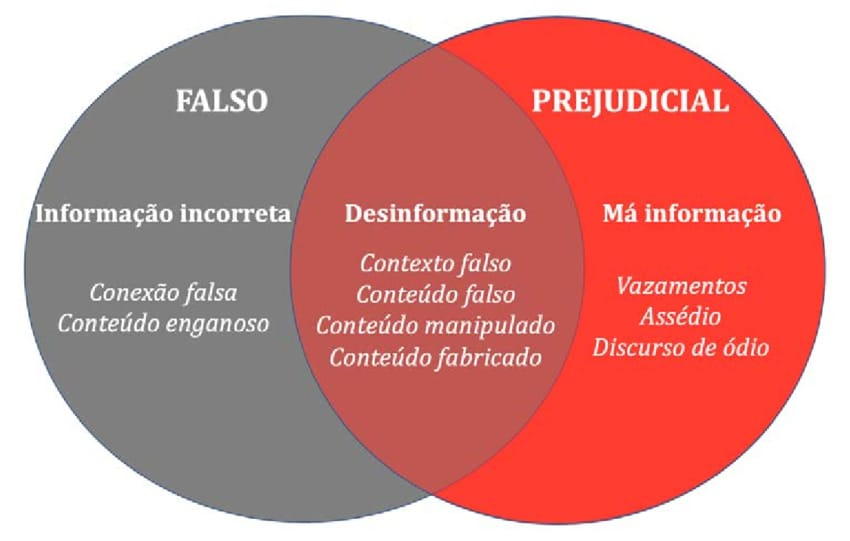

<!-- _class: hero -->

# Cyber

##  Projeto social voltado ao tópico de <i>Fake News</i> e desinformação

Dinâmica colaborativa por meio de um jogo interativo e didático sobre o assunto para a promoção da Cidadania Digital.

<!-- 
Consiste na aplicação de uma dinâmica colaborativa por meio de um jogo interativo e didático sobre o assunto.
 -->

  Projeto de extensão: Bytes para Cidadania
  Projeto: Cyber
  Jogo interativo virtual
  <!-- Modo Multiplayer -->

 
<!-- 
Davi Santos de Mesquita
 -->

---

## Equipe:

- Davi Santos de Mesquita
- José Ray Rodrigues Nascimento
- Lucas Vinicius David Martins
- Matheus Zaino Pinto Oliveira
- Pedro Antônio Vieira Sousa
- Pedro Ryan Coelho do Nascimento

---

## Tópicos da apresentação

- Contextualização
- Objetivos
- Fundamentação teórica
- Metodologia
- Cronograma
- Resultados esperados
- Protótipo do jogo

---

<!-- _class: divider -->

01

## Contextualização

Explanação da ação proposta e de como ela pode promover Cidadania Digital, evidenciando sua relevância.

---

## Cidadania Digital

<strong>A dinâmica de consumo</strong> e da propagação de informação rápida e
acessível <strong>trouxe consigo alguns problemas para a sociedade, especialmente para
os mais jovens</strong>.

 Envolta desta problemática, é evidente que <strong>a população carece de
conhecimentos de como lidar de modo ético e responsável com esse novo
ambiente</strong>. 

   <strong>Para mitigar isso</strong>, a promoção da <strong>Cidadania Digital é de extrema importância</strong>, principalmente para a parcela da população que ainda está em processo de
desenvolvimento psicossocial – os mais jovens.

   <strong>Mas, o que é Cidadania Digital?</strong>

---

## Cidadania Digital
 

 A <strong>Cidadania Digital</strong> pode ser entendida como o
<strong>conjunto de direitos, deveres e comportamentos</strong> que o cidadão deve ter ao participar
do ambiente digital.

 Nesse aspecto, o <strong>exercício da cidadania digital</strong> pode ser
atribuído a diversos pontos, como: 

- Utilizar a tecnologia de modo responsável;
- Compreender sobre segurança e privacidade no ambiente virtual;
- Saber diferenciar informações falsas de verdadeiras no âmbito virtual.

 <strong>Qual a ação proposta para contribuir com a Cidadania Digital?</strong>

---

## Ação proposta
 

 Nesse prisma, notando a relevância da abordagem do tópico de <strong><i>fake news</i></strong> e
<strong>desinformação</strong> para a devida promoção da <strong>cidadania digital</strong>, <strong>a ação proposta</strong> para
promoção do tópico <strong>se delimita à dinâmica de um jogo digital com os alunos</strong>.

<!-- 
 <strong>Detalhes</strong> sobre a ação:
 -->

- O jogo proposto possuirá um enredo repleto de situações onde as <i>fake news</i> e a desinformação estarão presentes.
- O jogo atuará como uma ferramenta de aprendizagem prática e interativa;
- Os alunos serão apresentados a situações semelhantes às que
podem encontrar no cotidiano, devendo tomar decisões que influenciarão o
desenvolvimento da narrativa;
- A partir dessas escolhas, será possível discutir as
consequências de determinadas atitudes e apresentar maneiras mais seguras e
responsáveis de agir no ambiente digital.

---

## Ação proposta

 Por meio da ação proposta, busca-se expressar conhecimentos corretos e adequados do que deve ser feito nas problemáticas digitais citadas, de modo a <strong>promover</strong> a <strong>Cidadania Digital</strong> nas escolas, especialmente ao público do <strong>Ensino Fundamental II</strong>.

---

<!-- _class: divider -->

02

## Objetivos

Qual é o objetivo geral e quais são os objetivos específicos atrelados ao projeto Cyber?

---

## Objetivo geral

O objetivo geral do projeto é **promover a Cidadania Digital entre alunos do Ensino Fundamental II por meio da aplicação de um jogo digital interativo**, incentivando-os a combater fake news, desinformação e o mau uso das redes sociais através do pensamento crítico e da tomada de decisão colaborativa.

---

## Objetivos específicos

- Compreender de modo mais detalhado os aspectos atrelados ao conceito de fake news e desinformação, bem como a forma que os mesmos se relacionam com o tema de Cidadania Digital.
- Definir o enredo do jogo digital, adaptando o contexto e a linguagem utilizada para o público juvenil.
- Codificar o jogo digital, seguindo o que foi definido, visando alcançar uma estética de RPG.
- Aplicar a dinâmica com o jogo digital nas escolas, instruindo os alunos na tomada de decisão em situações que envolvem a problemática dentro do contexto do jogo, mas analogamente ao mundo real.
- Ensinar aos alunos, utilizando das opções de escolha disponíveis no jogo, como se deve agir, de modo ético e responsável, para lidar adequadamente com a problemática e combater a propagação de fake news e desinformação na vida real.
---

## Objetivos específicos

- **Aplicar um formulário** para os alunos **com a finalidade de obter um feedback acerca da ação efetuada**, de modo a **entender o quanto os alunos compreenderam sobre o tema**, bem **como poderíamos melhorar a dinâmica e o jogo**, coletando dados que poderão ser úteis para a elaboração de melhores metodologias e dinâmicas voltadas a esse público-alvo no futuro.

---

<!-- _class: divider -->

03

## Fundamentação

Explicação dos conceitos de Cidadania Digital, Fake News e desinformação

---

## Cidadania digital

<table class="cols">
<tr>

<td width="60%" style="text-align:left;">

- Direitos e responsabilidades
- Uso consciente da tecnologia
- Discernimento e pensamento crítico
- Educação digital e midiática
- Papel social nos meios digitais

</td>

<td width="40%" style="text-align:right;padding-right:0;">

</td>
</tr>
</table>

---

## Fake News

<table class="cols">
<tr>

<td width="30%" style="text-align:left;">

- Informações falsas
- Redes sociais
- Engajamento
- Falta de verificação
- Popularização do termo
- "Desordem Informacional"

</td>

<td width="70%" style="text-align:right;padding-right:0;">

</td>
</tr>
</table>

---

## Fake News

<table class="cols">
<tr>
<td width="63.4%">

 

</td>
<td width="36.6%">

</td>
</tr>
</table>

---

## Tipos de desordem informacional

<table class="cols">
<tr>
<td width="30%">

- Misinformation
- Malinformation
- Disinformation

 

</td>
<td width="70%">

</td>
</tr>
</table>

---

## Cidadania Digital no combate às Fake News

<table class="cols">
<tr>
<td width="30%">

- Pensamento crítico
- Verificação
- Educação midiática
- Responsabilidade
- Consciência digital

 

</td>
<td width="70%">

</td>
</tr>
</table>

---

<!-- _class: divider -->

04

## Metodologia

Descrição das etapas que fazem parte da composição do projeto.

---

## Etapa 1

A <strong>primeira etapa</strong> consiste na realização de uma <strong>pesquisa bibliográfica</strong> em fontes confiáveis <strong>sobre Cidadania Digital</strong>, <strong><i>fake news</i></strong>, <strong>desinformação</strong> e o **uso das redes sociais por crianças e adolescentes**.

 Nessa pesquisa, serão buscadas:

- Informações que permitam compreender o que caracteriza uma informação falsa ou enganosa;
- Como esse tipo de conteúdo pode ser disseminado na Internet;
- Quais dificuldades os jovens podem encontrar ao avaliar a veracidade de uma informação e quais atitudes podem ser tomadas para evitar sua propagação.

  **As informações encontradas servirão como base para a elaboração do conteúdo apresentado no jogo**.

---

## Etapa 2

Com base nas informações obtidas durante a pesquisa, **serão selecionados os principais conhecimentos que deverão ser trabalhados com os alunos**. 

Serão definidos, principalmente, exemplos de:

- Situações envolvendo fake news e desinformação;
- Formas de verificar uma informação antes de compartilhá-la; 
- Atitudes que contribuem para um uso mais responsável das redes sociais.

  **O conteúdo será adaptado para uma linguagem adequada aos estudantes do Ensino Fundamental II, buscando apresentar situações que façam parte ou sejam próximas de sua realidade**.

---

## Etapa 3

A terceira etapa será destinada ao **planejamento e desenvolvimento do jogo digital**. 

Nessa etapa será definida:

- A narrativa;
- Os personagens;
- As situações apresentadas;
- As opções de decisão disponíveis para os participantes.

  **Nesta etapa, planeja-se utilizar ferramentas de inteligência artificial para auxiliar no processo de desenvolvimento e codificação do jogo digital web**.

---

## Etapa 3

Considera-se, inicialmente, o provável uso das seguintes **tecnologias** para a construção do jogo:

- React 19
- Vite 6
- Tailwind CSS v4
- Lucide React
- Canvas Confetti
- DiceBear
- Web Audio API

---

## Etapa 4

Na quarta etapa **será realizada a aplicação do jogo com os estudantes**. A atividade **terá duração aproximada de uma hora** e **será conduzida pela equipe responsável pelo projeto**.

Os participantes serão apresentados à narrativa e convidados a tomar decisões de maneira colaborativa diante das situações apresentadas. 

Durante a atividade, serão realizadas explicações e discussões sobre as escolhas feitas, relacionando os acontecimentos do jogo com situações que podem ocorrer no cotidiano digital dos alunos.

---

## Etapa 5

Na quinta etapa, **será realizada uma avaliação da ação, buscando verificar a compreensão dos estudantes sobre os conteúdos apresentados**.

Nesta etapa, o feedback será obtido por meio da aplicação de um **questionário impresso ao fim da dinâmica**, mas também poderá ser obtido virtualmente no preenchimento de um formulário digital **ao finalizar o jogo**.

---

<!-- _class: divider -->

05

## Cronograma

Disposição das etapas ao longo das semanas destinadas ao projeto.

---

   

| Etapa | S1 | S2 | S3 | S4 | S5 | S6 | S7 | S8 | S9 | 
|---|---|---|---|---|---|---|---|---|---|
| 1 | x |   |   |   |   |   |   |   |   | 
| 2 | x | x | x | x |   |   |   |   |   | 
| 3 | x | x | x | x |   |   |   |   |   | 
| 4 |   |   |   |   | x | x | x | x | x | 
| 5 |   |   |   |   | x | x | x | x | x | 

---

<!-- _class: divider -->

06

## Resultados esperados e avaliação

---

## Expectativa

Ao fim da aplicação do projeto, **espera-se que os participantes sejam capazes de**:

- Reconhecer situações de desinformação presentes no cotidiano digital
- Refletir antes de compartilhar conteúdos e compreender a importância de verificar a veracidade das informações antes de repassá-las para outras pessoas

  Além disso, espera-se estimular:

- O pensamento crítico;
- A responsabilidade;
- A ética;
- O respeito no ambiente digital.

---

## Avaliação

Será aplicado um breve questionário após a atividade, buscando identificar se a ação reverberou em maior conhecimento dos participantes sobre o assunto abordado.

Entre os aspectos que podem ser avaliados nesse contexto, destacam-se:

- Capacidade de identificar informações potencialmente falsas ou enganosas;
- Compreensão da importância de verificar uma informação antes de compartilhá-la;
- Reconhecimento de atitudes responsáveis no uso das redes sociais;
- Capacidade de analisar as consequências das próprias decisões no ambiente digital;
- Participação e colaboração durante o desenvolvimento do enredo do jogo;
- Compreensão dos princípios básicos da Cidadania Digital.

---

## Sobre o jogo

Espera-se que:

- Cumpra o papel didático proposto;
- Seja hospedado em algum domínio, possuindo uma URL para acesso;
- Seu código-fonte seja público;
- Seja divulgado nas redes sociais (ex.: Instagram).

---

<!-- _class: divider -->

07 - Protótipo

## Jogo Digital Interativo

 Um esboço do jogo proposto.

---
<!-- _class: game-slide -->
<!-- <iframe src="http://localhost:5173" style="width: 100%; height: 100%; border: none; display: block;"></iframe> -->
<iframe src="./game/dist/" style="width: 100%; height: 100%; border: none; display: block;"></iframe>
---